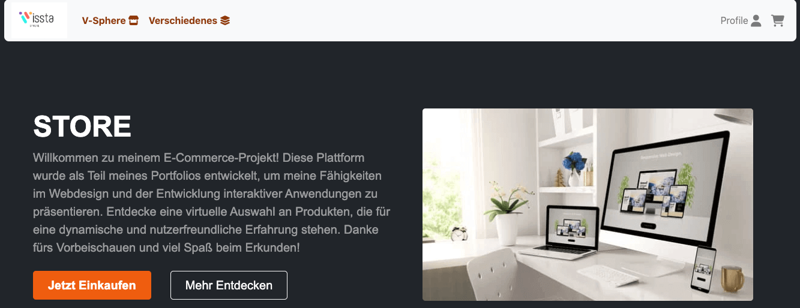
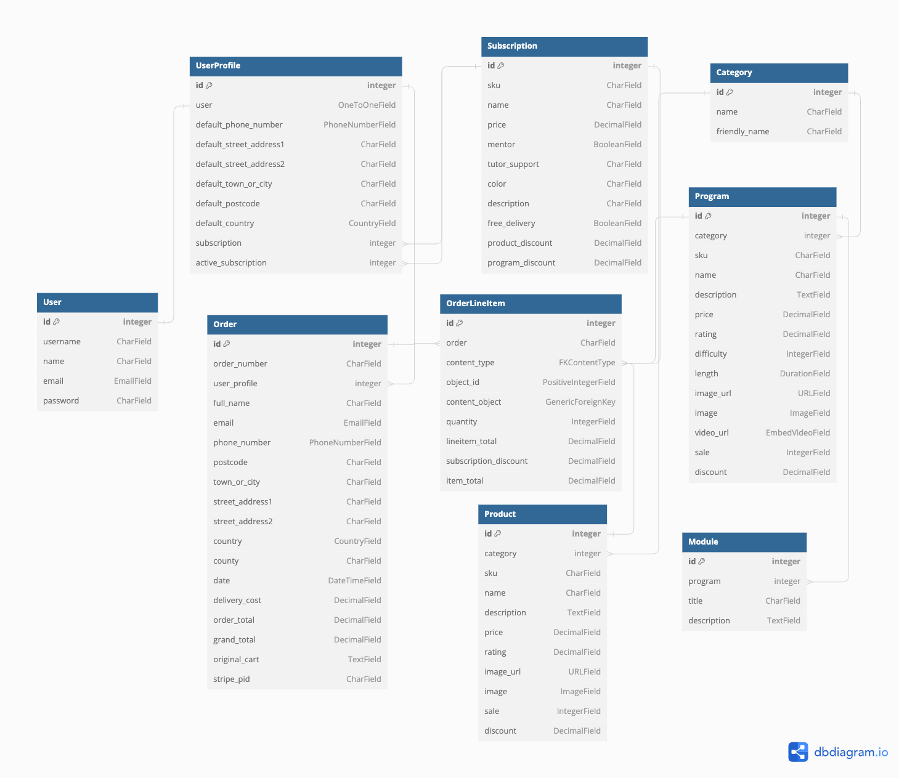
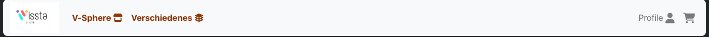

# CI-Swag PP5

[(Developer: Darrach Barneveld)](https://github.com/Noah-Samawi)

[Link to deployed site](https://www.vissta-sphere.com/ or https://visste-sphere-93169428c40e.herokuapp.com/)

<hr>
Vissta Sphere is an online merchandise store catering specifically to software developers. It also is an edu platform where users can enroll in extra online courses and subscribe to memberships. Built using Python, Django, HTML, CSS, JavaScript, Amazon S3 and Stripe.



# Table Of Content

- [User Experience](#user-experience)
  - [User Stories](#user-stories)
  - [Site Goals](#site-goals)
  - [Scope](#scope)
- [Design](#design)
  - [Colour Scheme](#colour-scheme)
  - [Database Schema](#database-schema)
  - [Models](#models)
  - [Fonts](#fonts)
  - [Wireframes](#wireframes)
  - [Agile Methodology](#agile-methodology)
    - [Overview](#overview)
    - [EPICS(Milestones)](#epics---milestones)
    - [User Stories Issues](#user-stories---issues)
    - [MoSCoW prioritisation](#moscow-prioritisation)
    - [GitHub Projects](#github-projectskanban)
    - [Late Design Changes](#late-design-changes)
- [Features](#features)
  - [Navigation Header](#navigation-header)
  - [Footer](#footer)
  - [Home Page](#home-page)
  - [Products Page](#products-page)
  - [Miscellaneous Page](#programs-page)
  - [Subscriptions Page](#subscriptions-page)
  - [Product Detail Page](#product-detail-page)
  - [Miscellaneous Detail Page](#program-detail-page)
  - [Cart Page](#cart-page)
  - [Checkout Page](#checkout-page)
  - [Confirmation Page](#confirmation-page)
  - [Profile Page](#profile-page)
  - [My Miscellaneous Page](#my-courses-page)
  - [Privacy Policy Page](#privacy-policy-page)
  - [Sign In Page](#sign-in-page)
  - [Sign Up Page](#sign-up-page)
  - [Sign Out Page](#sign-out-page)
  - [Newsletter](#newsletter)
  - [Notification Messages](#notification-messages)
  - [Confirmation Modal](#confirmation-modal)
  - [Password Reset Page](#password-reset-page)
  - [Password Change Page](#password-change-page)
  - [Email Verification](#email-verification)
  - [Order Confirmation Email](#order-confirmation-email)
  - [Password Reset Email ](#password-reset-email)
  - [Error Pages](#error-pages)
  - [Future Features](#future-features)
- [Marketing](#marketing)
  - [Initial Plan](#initial-plan)
  - [Paid Business Plan](#paid-business-plan)
- [Search Engine Optimization SEO](#search-engine-optimization-seo)
- [Testing](#testing)
- [Bugs](#bugs)
- [Technologies and Languages](#technologies-and-languages)
  - [Languages](#languages-used)
  - [Python Modules](#python-modules-imported)
  - [Technologies and programs](#technologies-and-programs)
- [Deployment](#deployment)
  - [Pre Deployment](#pre-deployment)
    - [Stripe Setup](#stripe-setup)
    - [AWS Setup](#aws-setup)
  - [Deployment on Heroku](#deployment-on-heroku)
  - [Fork the Repository](#fork-the-repository)
  - [Clone the Repository](#clone-the-repository)
  - [Run the Repository Locally](#run-the-repository-locally)
- [Credits](#credits)
  - [Content](#content)
  - [Media](#media)
  - [Code](#code)
  - [Acknowledgements](#acknowledgements)

## User Experience

### User Stories
In progress

### Site Goals

Sell a variety of merchandise to cater to the diverse interests and needs of customers.
Offer subscription options for discounts to incentivize repeat purchases and foster customer loyalty.
Encourage community engagement and interaction to build a strong customer base through newsletters and marketing pages.
Execute effective marketing and promotion strategies to attract and retain customers.

### Scope

The project combines an online store with a focus on selling diverse merchandise. Users can shop for products that cater to their interests, and the platform is designed to ensure user-friendliness, accessibility, and enjoyment. Members will also have access to rewards and exclusive discounts to foster a loyal customer community. The platform will encompass the following key features:

1. [EPIC - Initial Set Up:]()


2. [EPIC - UX Design Planning:]()


3. [EPIC - Data Modelling:]()


4. [User Authentication:]()


5. [EPIC - Site Layout:]()


6. [EPIC - UI UX Styling:]()


7. [EPIC - Cart And Checkout:]()


8. [EPIC - Bug Fixes:]()


9. [EPIC - Documentation:]()


10. [EPIC - Marketing and SEO]()


## Design

The primary design goal of Vissta Sphere was to ensure clear categorization of products, memberships, and subscription options. The website must distinctly separate the eCommerce store from other sections, making it easy for users to navigate and shop.

The main objective of the website design was to provide an incredibly user-friendly and efficient navigation experience. This was achieved through an intuitive product filtering system, related item suggestions, and a responsive, clean navigation menu. Links throughout various areas of the site also provide easy return navigation options.

We focused on creating a clear distinction between authenticated and non-authenticated users. Authenticated users can access additional content, view order history, manage memberships, and update personal information.

The design ensures consistency across all pages while providing a unique feel for each section. This was achieved through reusable components, consistent color schemes, buttons, forms, and other UI elements. The goal was for users to feel as though they were enjoying a fun and engaging shopping experience, much like browsing a physical store.

This commitment to intuitive navigation and user-centered design remained at the forefront of the project’s development.

In order to enhance development style I researched different styling options via Bootstrap template examples and was greatly inspired by [StartBootstrap](https://startbootstrap.com/templates/ecommerce)

### Colour Scheme

The websites colour theme closly mimics Code Institutes colour theme. The use of orange, black, white and grey are the primary colours to help mimic the feel. Action components such as checkout, pay now or update forms are clearly distinguished with a bold blue or green colour, while all other less important/navigation buttons are consistant with the theme.


### Database Schema



### Models

#### Allauth User Model

The User model is an integral component of Django Allauth, featuring pre-established fields as part of its standard configuration. Among these fields are username, email, name, password, and others. This model primarily serves the purpose of user authentication, which is why it is not recommended to make direct alterations to it. Furthermore, the User model is linked to the Profile model through a one-to-one relationship, facilitating the management of user-specific data and interactions.

#### Profile Model

Profile Model: The Profile Model provides a snapshot of each user's presence on the platform, encapsulating their user information, delivery information and order history. It is has a one to one relationship with the auth User Model.

#### Category Model

The Category Model categorises products and programs, ensuring users can easily discover relatable products/programs.

#### Product Model

The Product Model is one of the main models of the application and is closely similar to the program model. It includes image, price, name, description, sku, discounts, sale and rating.

#### Program Model

The program model contains all fields of the product model with extra field such as difficulty, videourl and length that are unique to it.

#### Module Model

The moduel model is linked closely to the program model. A module contains a tile and description and is linked to a program

#### Subscription Model

The subscription model is a model that holds information about a users membership. It has one to many relationship with a userprofile. A subscription contains discounts amounts on products and programs.

#### Order Model

The Order model contains information about a purchase. It contains lineitems of products. Products are based on a generic key type as they can be either products, programs or subscriptions. Its fields are date, lineitems, delivery, user and total cost.

#### OrderLine Item

The Order Line Item model is linked to the Order Model. Its fields are an FK to an order, the content_type, object_id, content_object, quantity, total, discount and item total.

### Fonts

The font used in this project is Segoe UI Roboto, which give a standard feel as mimiced in the CI website. <br>


### Wireframes

#### Desktop


#### Mobile


#### Late Design Changes

A key late design change was to alter the Phonenumber field within the Profile model. This was both linked to orders and user profiles. An issue was dealing with accessibiliy of the country selector phone number code and the entry of the number in a standardised format to the Order model. The result was removing this feature and instead prompting the user to fill in an international number with error context rendered.

## Features

### Navigation Header

The navigation bar is a consistent element across all pages, designed using Bootstrap and optimised for full responsiveness. The left is centered around navigation of content while the right hand side is related to user authentication. Authenticated users can also see create posts and view profile links while unauthenticated users only see a prompt to login/register.

The mobile version of the navbar has all the content rendered when a hamburger icon is clicked. When clicked a dropdown display is rendered showing all navigation links.

<details><summary>Navbar</summary>

</details>

<details><summary>Mobile</summary>

</details>

### Footer

The footer contains all the contact informtion about the website as well as the copywrite of trademark. It links to the socials as well as developers contact email. The privacy policy is also linked here

<details><summary>Footer</summary>

</details>

### Home Page

The homepage serves as the central hub of the site, providing visitors with an overview of its offerings, including featured products, testimonials, imagery, and marketing copy. It serves as a gateway to navigate the store sections through shop now navigation links, inviting users to explore further and discover more about the brand's offerings and value propositions. It uses the fold of the screen to showcase branding imagery.

<details><summary>Home</summary>

</details>

### Products Page

The products page showcases preview cards of various products, each accompanied by basic descriptions and images, offering users a quick overview of available items. A filtering system based on categories, prices, sales, and ratings, so users can refine their search to find desired products. Additionally, a search bar enables users to explore specific items, enhancing their browsing experience and allowing them to refine very specific requests.

<details><summary>Products</summary>

</details>

### Add/Edit Products Page

The Add/Edit products page displays a simple form where moderators or admins can add products to the database. Exisiting products can be edited or deleted. This gives business owners the ability to adjust prices, images, sales and other fields so as to keep an up to date inventory and business model

A design decision was made here to allow moderators to add and edit products as well as superusers/admins. This meant business owners could give potential employees powers to edit inventory but not directly have access to the secure admin portal that had full CRUD functionality.

<details><summary>Add/Edit Products</summary>

</details>

### Programs Page

Similar to the products page, the programs page presents preview cards of different educational programs, providing brief descriptions and images to offer users a glimpse into each program's content and offerings. Searchbar and filtering tools remain consistant with the products page

<details><summary>Programs</summary>

</details>

### Subscriptions Page

The subscription page displays available membership packages, presenting users with a clear overview of the various subscription options offered. Users can easily identify their current membership package, allowing for seamless management and potential upgrades or downgrades as needed. This page provides transparency and accessibility for users to make informed decisions regarding their subscription preferences.

<details><summary>Subscriptions</summary>

</details>

### Product Detail Page

The product detail page contains information about the selected product, including price, rating, sale status, and SKU. Featuring an image of the product, users can view it before making a purchase decision. Additionally, the page lists related products at the bottom, offering users additional options to explore. With the option to adjust the quantity and an "Add to Cart" button where users can update there cart with a product quantity.

<details><summary>Product Detail</summary>

</details>

### Program Detail Page

The program detail page provides in-depth information about the selected program, including its name, duration, cost, and a breakdown of modules or sections covered. Users can gain an understanding of the program's content and structure before making a decision. Users must be authenticated before they can enroll in courses and users who have purchased the program, a related video is displayed, offering valuable insights or introductory content to enhance the learning experience.

In the future users will have videos relating to the courses and can track progress, however for the initial build there is just the dummy education video loaded.

<details><summary>Program Detail</summary>

</details>

### Cart Page

The cart page displays a summary of the items currently in the user's cart, presenting essential information such as product details and quantities. Additionally, users can view the total cost of all items in their cart as well as any discounts to certain items. This page serves as a hub users to review and manage their selected items before proceeding to checkout.

<details><summary>Cart</summary>

</details>

### Checkout Page

The checkout page streamlines the purchasing process, guiding users through the final steps of completing their orders. Users can review their selected items, input shipping and payment information. Users can add email changes and name changes for orders, but this will only affect a singler purpose. The checkout page provides order summary details, ensuring transparency regarding the total cost, including discounts and shipping fees. Stripe payment elements are used to handle the payment processing.

The checkout page is a two step processed. Verification of delivery address, and then payment verification. I allowed users to have alternate names and emails on orders so they could gift presents and emails with the correct name and email address would be reflected on a single order and not persisted to the database.

<details><summary>Checkout</summary>

</details>

### Confirmation Page

The thank you and order confirmation page serves as a final acknowledgment of the user's completed purchase, expressing gratitude for their patronage. It provides a summary of the order details, including items purchased, total cost, and shipping information. Additionally, users may receive confirmation numbers or order IDs for reference. This page also serves as the order history page so users can review all orders they have purchased.

<details><summary>Confirmation</summary>

</details>

### Profile Page

The profile page is where users can easily update their user details such as name and username as well as and edit delivery information. Users can access a overview of their past orders, allowing them to track their purchase history and review previous transactions.

<details><summary>Profile</summary>

</details>

### My Courses Page

The my courses page gives authenticated users quick access to view there total purchased courses. It shows a list of all program preview cards for courses that have been purchased in their order history.

<details><summary>Profile</summary>

</details>

### Privacy Policy Page

This page indicates the legal text of the website and informs users of the privacy and policies as they will be submitting personal data to the website upon checkout. This page was created using a policy generator.

<details><summary>Privacy Policy Page</summary>

</details>

### Sign In page

This page comprises a form with fields for entering a username and password. Beneath the form is the sign up button which submits the form. Below the form is a redirect to the register page if the user does not have an account. Click the remember me checkbox to remain logged in as a session.

<details><summary>Sign In</summary>

</details>

### Sign Up page

It features a form with fields for inputting name, email, username, password, and password confirmation. Underneath the form, there is a link to log in for users with existing accounts, followed by the signup button. After signup, users receive a welcome email at the provided email address and are then directed to the home page.

<details><summary>Sign Up</summary>

</details>

### Sign out page

Upon clicking the "log out" link in the navigation, users are directed to a confirmation page. This page includes a cautionary message and two buttons: one for returning and one for logging out.

<details><summary>Sign Out</summary>

</details>

### Newsletter

An area where users can input there email to sign up to a newsletter. Users dont have to be authenticated to signup to the newsletter

<details><summary>Newsletter</summary>

</details>

### Notification Messages

Notification messages were user every time the user performs CRUD operation, sign in, and sign out.

<details><summary>Notifications</summary>

</details>

### Confirmation Modal

This modal appears whenever a users is performing a delete CRUD operation. It ensures the user must confirm their action before the permanent deletion of a subscription

<details><summary>Confirmation Modal</summary>

</details>

### Searchbar

This reusable component allows for quick searching of products and programs. When searching it will search by category, description and title. It will only search within the category selected if you have pre filtered by category, hence narrowing the search. Blending filters and search queries gives the best results

<details><summary>Searchbar </summary>

</details>

### Password Reset Page

This page is for users that which to request a password reset verification link to an email

<details><summary>Password Reset Page</summary>

</details>

### Password Change Page

This page is for users that clicked the verification link in their email to change a password. Once password is updated they are redirected to sign in again

<details><summary>Password Change Page</summary>

</details>

### Account Deletion

This Feature allows users to delete their accounts so that all there personal data can be removed from the website. This adheres to GDPR principles

<details><summary>Account Deletion</summary>

</details>

### Email Verification

An email is sent to a users selected email address on sign up requesting the verification of that email

<details><summary>Email Verification</summary>

</details>

### Order Confirmation Email

An email is sent to both authnetication and non authenticated users upon the completion of a successful purchase from the store

<details><summary>Order Confirmation Email</summary>

</details>

### Password Reset Email

The Email template sent to a users inbox when they used the forgot password reset feature

<details><summary>Password Reset Email</summary>

</details>

### Error Pages

Custom Error pages are rendered to show the user what went wrong with their request. These error pages allow the user to redirect to the home page.

An Example below is the 400 page

<details><summary>400</summary>

</details>

## Future Features

### Add/Edit Programs

Enable administrators or moderators to add and update programs.

### Product Review

Enable users to share their experiences and feedback by writing reviews for products they have purchased. This feature enhances transparency and assists other users in making informed purchase decisions.

### Updating Emails

Allow users to easily update their email addresses associated with their accounts. This feature ensures that users can maintain accurate up to date information for ordering.

### Course Tracker

Implement a tracker that monitors users' progress through online courses based on completed modules. This feature provides users with a visual representation of their learning journey, helping them stay motivated and track their advancement towards course completion.

## Marketing

The B2C (Business-to-Consumer) ecommerce model is adopted for CISwag as it is an online merchandise and edu platform platform catering to individual consumers looking to purchase a wide array of coding related products or enroll in supplementary education courses.

The main target audience will be software engineering students or existing developers.

Vissta Sphere's marketing strategy will focus on online channels to boost traffic and engagement. There will be an initial setup as seen in this project followed by the hypothesis of a marketing strategy that can be used when payments/business accounts are installed.

### Initial Plan

Facebook will serve as the primary platform, with a dedicated business page promoting products and fostering customer interaction. Posts will be made on the business page as well as information pertaining to the website. A automated bot will be setup to answer FAQ questions.

Additionally, Mailchimp will be utilized for weekly newsletters, updating subscribers on new offerings, promotions, and site enhancements. Emails of users can then be input into FB, google and other online providers to build an audience list.

By combining social media outreach with targeted email marketing, Vissta Sphere aims to effectively engage its audience, drive website traffic, and enhance brand visibility in the competitive ecommerce landscape.


### Paid Business Plan

Hypthoesis of a marketing plan for paid business. This will be broken down into 3 keys online providers. This will required GDPR considerations as well as a verified business.

#### Facebook

1. Boosted posts on the business homepage to extend reach
2. Installation of FB pixel throughout the website to capture analytics - CTR - Add To Cart, Purchase
3. Targeted add campaigns based on audience demographics and LLA audience modelling

#### Instagram

1. Reels and Shorts created to showcase products and testimonials
2. Linked to FB pixel for tracking performance metrics

### Google

1. Creating a google business account and updating business directory
2. Google ads for targeting audiences with banner ads and promoted search results
3. Analytics for understanding traffic and audience
4. Installing pixel throughout the website for key metrics

### Subscriptions

A demo subscription model was used in this application, enabling users to subscribe for benefits. Subscribers are billed on a monthly basis. However, since the Stripe account used is for testing purposes, monthly billing is inactive in this iteration, and memberships require a one-time payment.

## Search Engine Optimization SEO

1. Descriptive meta tags were added to the main template, including title, description and keywords.
2. A sitemap was generated using [xml-sitemaps](https://www.xml-sitemaps.com/) This was generated using the deployed website. The file is included in the root level of the project.
3. Robots.txt file was created at the root level of the project. This file tells the search engine crawlers which URLs they can access on the website.

Future creation of a Google business account will improve SEO performance and website ratings.

## Testing

In depth testing documentation can be found [here.](./TESTING.md)

## Bugs

Here is a list of all the major bugs encountered throughout development. Links to specific issues provide a more in depth analysis of how they were identified and resolved. This can also be found documented in [TESTING.md](./TESTING.md)

| Bug                                                                                                      | Status |
| -------------------------------------------------------------------------------------------------------- | ------ |
| [Bug: Negative Products #52](https://github.com/DarrachBarneveld/ci-swag/issues/52)                      | Closed |
| [Bug: Adding Generic Items To Cart #59](https://github.com/DarrachBarneveld/ci-swag/issues/59)           | Closed |
| [Bug: Checkout Form Error Context #60](https://github.com/DarrachBarneveld/ci-swag/issues/60)            | Closed |
| [Bug: PhoneNumber Order Widget #63](https://github.com/DarrachBarneveld/ci-swag/issues/63)               | Closed |
| [Bug: Stripe Autofill #66](https://github.com/DarrachBarneveld/ci-swag/issues/66)                        | Closed |
| [Bug: Form Accessibiliy #67](https://github.com/DarrachBarneveld/ci-swag/issues/67)                      | Closed |
| [Bug: Form Accessibiliy #67](https://github.com/DarrachBarneveld/ci-swag/issues/67)                      | Closed |
| [Bug: LCP Page Performance #70](https://github.com/DarrachBarneveld/ci-swag/issues/70)                   | Open   |
| [Bug: Stripe WH Order Creation #75](https://github.com/DarrachBarneveld/ci-swag/issues/75)               | Closed |
| [Bug: Stripe WH fires on invalid order error #76](https://github.com/DarrachBarneveld/ci-swag/issues/76) | Closed |
| [Bug: No Update Quantity On Added Products #80](https://github.com/DarrachBarneveld/ci-swag/issues/80)   | Closed |
| [Bug: Query newly added product #81](https://github.com/DarrachBarneveld/ci-swag/issues/81)              | Open   |
| [Bug: Message Overlay #82](https://github.com/DarrachBarneveld/ci-swag/issues/82)                        | Open   |

## Technologies And Languages

### Languages Used

- HTML
- CSS
- JavaScript
- JQuery
- Bootstrap
- Python
- Django

### Python Modules Imported

[Django-allauth](https://pypi.org/project/django-allauth/) is a versatile authentication and account management package for Django, providing a comprehensive set of features for user registration, authentication, account management, and social account integration.

[Dj-database-url](https://pypi.org/project/dj-database-url/) is used to parse the database URL specified in the DATABASE_URL environment variable, which is commonly used for configuring database connections in Django projects.

[Gunicorn](https://pypi.org/project/gunicorn/) is a popular WSGI (Web Server Gateway Interface) HTTP server for running Python web applications, including Django applications, in a production environment.

[Psycopg2](https://pypi.org/project/psycopg2/) is a PostgreSQL adapter for Python. It allows Django to connect to PostgreSQL databases.

[Django Crispy Forms](https://pypi.org/project/django-crispy-forms/) is a Django application that enhances the presentation and customization of Django forms, making it easier to create aesthetically pleasing and responsive forms for web applications.

[Boto3](https://pypi.org/project/boto3/) is the Amazon Web Services (AWS) SDK for Python. It allows to interact with AWS services, such as S3 storage for media/static files

[Pillow](https://pypi.org/project/pillow/) is a Python Imaging Library (PIL) fork that provides tools for working with images in various formats.

[Django-phonenumber-field](https://pypi.org/project/django-phonenumber-field/) is a library to assist in verification of phonenumbers

[Django Storages](https://pypi.org/project/django-storages/) Django Storages simplifies file storage management in Django apps by offering custom backends.

[Django Embed Video](https://pypi.org/project/django-embed-video/) Django-embed-video is a Django app that simplifies embedding videos from various platforms, such as YouTube and Vimeo, into Django templates by providing template tags and model fields.

[Stripe](https://pypi.org/project/stripe/) Stripe is a payment processing platform that enables payments by offering a developer-friendly API and a range of customizable payment solutions.

### Technologies and programs

- [Bootstrap](https://getbootstrap.com/) was used to quickly layout the responsive structure of the website
- [JQuery](https://jquery.com/) was used to apply all javascript functionality in a more efficient manner
- [Chat-GPT](https://chat.openai.com/) was used to create all written content and copy of the website
- [VS Code](https://code.visualstudio.com/) was used to code the website locally
- [Balsamiq - Wireframe](https://balsamiq.com/wireframes/) was used to create quick and precise wireframes
- [Favicon Generator](https://favicon.io/favicon-converter/) was used to generate Favicon
- [Font Awesome](https://fontawesome.com/) was used for all icons on the website
- [GitHub](https://github.com/) is the hosting site used to store the code for the website.
- [Git](https://git-scm.com/) was used as a version control software to commit and push the code to the GitHub repository.
- [Google Chrome Lighthouse](https://developers.google.com/web/tools/lighthouse) was used for scoring the website during the testing phase
- [Google Chrome Developer Tools](https://developer.chrome.com/docs/devtools/overview/) was used during testing, debugging and making the website responsive.
- [W3C HTML Validator](https://validator.w3.org/) was used to check for errors in the HTML code.
- [W3C CSS Validator](https://jigsaw.w3.org/css-validator/) was used to check for errors in the CSS code
- [Wave Accessibility Tool](https://wave.webaim.org/) was used during testing to check accessibility
- [WebAim Contrast Checker](https://webaim.org/resources/contrastchecker/) was used to ensure proper contrast guidelines where adhered to.
- [Pylance Validator](https://marketplace.visualstudio.com/items?itemName=ms-python.vscode-pylance) was used as a linter to enhance best practice in the Python code.
- [CI Python Pep8 Checker](https://pep8ci.herokuapp.com/) was used to validate the Python code.
- [Stripe](https://stripe.com/) was used to handle all payment processing
- [AWS](https://aws.amazon.com/) was used host all static and media files for the site.
- [Coolors.co](https://coolors.co/) was used to display the colour scheme.
- [Pixelied](https://pixelied.com/convert/png-converter/png-to-webp) was used to convert images into nextgen formats
- [DBDiagram](https://dbdiagram.io/) was used to visually create the database structure and schemas
- [PostGresSQl](https://www.postgresql.org/) was used in development to store the database information locally
- [ElephantSQL](https://www.elephantsql.com/) was the database hosting provider for the production app
- [Heroku](https://heroku.com/) was the hosting provider used.

## Deployment

### Pre Deployment

To ensure the application is deployed correctly on Heroku it is mandatory to update the requirements.txt. This is a list of requirements that the application needs in order to run.

- To create the list of requirements we use the command pip3 freeze > requirements.txt. This will ensure the file with the requirements is updated.
- Then commit and push the changes to GitHub.

! Before pushing code to GitHub ensure all credentials are in an env.py file, which is included in the .gitignore file. This tells Git not to track this file which will prevent it from being added to Github and the credentials being exposed.

### Stripe setup

- Log in to [Stripe](https://stripe.com/en-ie)
- Navigate to developers section (link located at the top right)
- Go to API keys tab and copy the values of PUBLIC_KEY and SECRET_KEY and add them to your env.py file
- Navigate to the Webhooks page from the tab in the menu at the top and click on add endpoint.
- This section requires a link to the deployed application. The link should look like this https://your_website.herokuapp.com/checkout/wh/
- Choose the events the webhook should recieve and add endpoint.
- When the application is deployed, run a test transaction to ensure the webhooks are working. The events chan be checked in the webhooks page.

### AWS setup

- Log in to [AWS](https://aws.amazon.com/)

1. Create a new S3 bucket:

- Choose the closest AWS region.
- Add unique bucket name.
- Under Object Ownership select ACLs enabled to allow access to the objects in the bucket.
- Under Block Public Access settings unselect block all public access as the application will need access to the objects in the bucket.
- Click on create bucket.

2. Edit bucket settings.

- Bucket properties
  - Open the bucket page.
  - Go to properties tab and scroll down to website hosting and click on edit.
  - Enable static website hosting
  - Under the Hosting type section ensure Host a static website is selected.
  - Add Index.html to index document field and error.html to error document field and click save.
- Bucket permissions

  - Navigate and Click on the "Permissions" tab.
  - Scroll down to the "CORS configuration" section and click edit.
  - Enter the following snippet into the text box and click on save changes.

  ```
  [
  {
      "AllowedHeaders": [
          "Authorization"
      ],
      "AllowedMethods": [
          "GET"
      ],
      "AllowedOrigins": [
          "*"
      ],
      "ExposeHeaders": []
  }
  ]
  ```

  - Scroll to bucket policy section and click edit. Take note of the bucket arn (Example: arn:aws:s3:::test-bucket)
  - Click on policy generator and set the following settings:

    1. Select Type of Policy - S3 Bucket Policy
    2. Effect Allow
    3. Principal \*
    4. AWS Service Amazon S3
    5. Actions: GetObject
    6. Amazon arn: your arn from the previous page

  - Click on add statement and then generate policy.Copy the policy
  - Paste the policy into the bucket policy editor.
  - Add "/\*" to the end of the resource key to allow access to all resources in this bucket.
  - Navigate and Click Save changes.
  - For the Access control list (ACL) section, click edit and enable List for Everyone (public access) and accept the warning box. If the edit button is disabled, you need to change the Object Ownership section above to ACLs enabled (refer to Create Bucket section above).

3. Identify and Access Management (IAM)

- Create User group
  - In the search bar, search for IAM.
  - On the IAM page select user groups in the menu on the left.
  - Click on create user group, add a name and click create group. The users and permission policies will be added later.
- Create Permissions policy for the user group

  - Go to Policies in the left-hand menu and click create policy
  - Click on actions and import policy.
  - Search for "AmazonS3FullAccess", select this policy, and click "Import".
  - Click "JSON" under "Policy Document" to see the imported policy
  - Copy the bucket ARN from the bucket policy page and paste it into the "Resource" section of the JSON snippet. Be sure to remove the default value of the resource key ("_") and replace it with the bucket ARN.
    Copy the bucket ARN a second time into the "Resource" section of the JSON snippet. This time, add "/_" to the end of the ARN to allow access to all resources in this bucket.

  ```
      {
      "Version": "2012-10-17",
      "Statement": [
          {
              "Effect": "Allow",
              "Action": [
                  "s3:*",
                  "s3-object-lambda:*"
              ],
              "Resource": [
                  "arn:aws:s3:::your-project",
                  "arn:aws:s3:::your-project/*"
              ]
          }
      ]
  }

  ```

  - On the next page add polcity name and description and click create policy.

- Attach Policy to User Group

  - Click on User Groups in the left-hand menu.
  - Click on the user group name created during the above step and select the permissions tab.
  - Click Attach Policy.
  - Search for the policy created during the above step, select it and click attach policy.

- Create User
  - Click on Users in the left-hand menu and click on add user.
  - Enter a User name .
  - Select Programmatic access and AWS Management Console access and click next.
  - Click on add user to group, select the user group created earlier and click create user.
  - Take note of the Access key ID and Secret access key as these will be needed to connect to the S3 bucket.
  - To save a copy of the credentials click Download .csv

### Deployment on Heroku

- To deploy the project on Heroku, first create an account.
- Once logged in, create a new app by clicking on the create app button
- Pick a unique name for the app, select a region, and click Create App.
- On the next page select the settings tab and scroll down to Config Vars. If there are any files that should be hidden like credentials and API keys they should be added here. In this project, there are credentials that need to be protected. This project requires credentials added for:

        1. Django's secret key
        2. Database Credentials
        3. AWS access key
        3. AWS secret key
        4. Email host password.
        5. Stripe public key
        6. stripe secret key
        7. Stripe wh secret

- Scroll down to Buildpacks. The buildpacks will install further dependencies that are not included in the requirements.txt. For this project, the buildpack required is Python
- From the tab above select the deploy section.
- The deployment method for this project is GitHub. Once selected, confirm that we want to connect to GitHub, search for the repository name, and click connect to connect the Heroku app to our GitHub code.
- Scroll further down to the deploy section where automatic deploys can be enabled, which means that the app will update every time code is pushed to GitHub. Click deploy and wait for the app to be built. Once this is done, a message should appear letting us know that the app was successfully deployed with a view button to see the app.

### Fork the Repository

1. Navigate to the [repository](https://github.com/Dayana-N/Book-Heaven-PP5)
2. In the top-right corner of the page click on the fork button and select create a fork.
3. You can change the name of the fork and add description
4. Choose to copy only the main branch or all branches to the new fork.
5. Click Create a Fork. A repository should appear in your GitHub

### Clone the Repository

1. Navigate to the [repository](https://github.com/Dayana-N/Book-Heaven-PP5)
2. Click on the Code button on top of the repository and copy the link.
3. Open Git Bash and change the working directory to the location where you want the cloned directory.
4. Type git clone and then paste the link.
5. Press Enter to create your local clone.

### Run The Repository Locally

1. Go to the GitHub repository
2. Locate the green Code button above the list of files and click it
3. From the dropdown menu select download Zip.
4. Download and open the zip file to run in an editor
5. Create an env.py file and input the environment variables
6. Ensure [PostgreSQL](https://www.postgresql.org/) is install on your computer and ports are open
7. Create a virtual environment for installing the python modules in the pip file.
8. Run python3 makemigrations, migrate and runserver

## Credits

### Content

Additionaly copy for the website was prompted with use of [ChatGPT](https://chat.openai.com/)
For Readme/Testing templates inspiration and guidance from [BookHeaven](https://github.com/Dayana-N/Book-Heaven-PP5/blob/main/README.md)

### Media

All Media images on this website were created using [Leondardo AI](https://leonardo.ai/)
[Demo Course Video](https://www.youtube.com/watch?v=TjPFZaMe2yw&t=2s)

### Code

- Boutique Ado  Walkthrough was used for the base of this project
- [Content Type Framework](https://docs.djangoproject.com/en/5.0/ref/contrib/contenttypes/)
- [Content Type Admin Crud](https://copyprogramming.com/howto/how-can-i-customize-the-display-of-a-model-using-contenttypes-in-the-admin)
- [Bootstrap Templates](https://startbootstrap.com/templates/ecommerce)
- [Local Stripe Webhook Testing](https://www.youtube.com/watch?v=q33qN2zz4E4&t=453s)
- [Basic Automated Tests](https://learndjango.com/tutorials/django-testing-tutorial)
- [Client Testing](https://docs.djangoproject.com/en/5.0/topics/testing/tools/)
- [Custom Template Tags](https://realpython.com/django-template-custom-tags-filters/#:~:text=Custom%20tags%20and%20filters%20live,to%20load%20the%20tag%20library.)
